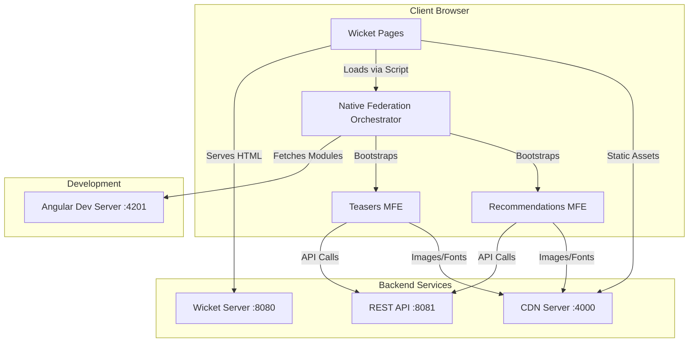
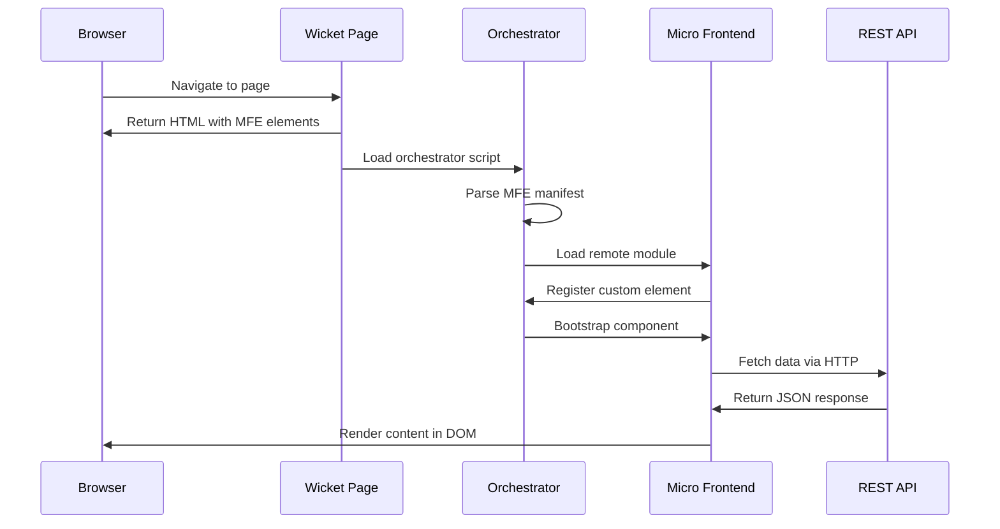
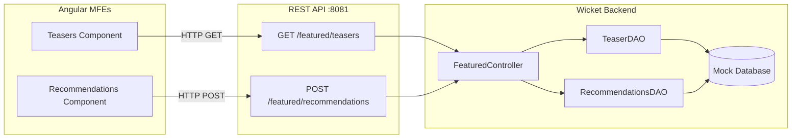
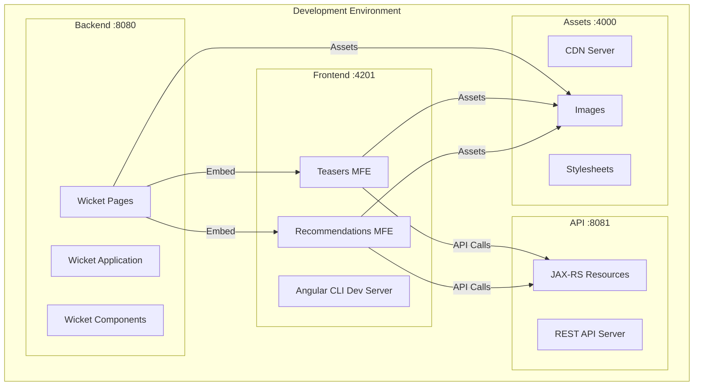

# Wicket + Angular Native Federation Examples

This demo application demonstrates how Angular micro frontends can be loaded into a Wicket monolith using native federation. The project showcases two independent micro frontend components that can be consumed by a host application.

The native-federation orchestrator used to load micro frontends in the Wicket host can be found here:

https://github.com/topicusonderwijs/vanilla-native-federation

And the Native federation package for building the micro frontends:

https://github.com/angular-architects/module-federation-plugin/tree/main/libs/native-federation

## 🏗️ Architecture Overview

This project uses **Angular Native Federation** to create standalone micro frontends that can be dynamically loaded and integrated into any host application. The architecture follows the micro frontend pattern where each component is:

- **Independently deployable**
- **Technology agnostic** (can be consumed by any framework)
- **Self-contained** with its own dependencies and configuration

### System Architecture



### Component Interaction Flow



The system consists of:
- **Wicket Monolith** (Java) - Host application serving core e-commerce functionality
- **Angular Micro Frontends** (TypeScript) - Standalone components for teasers and recommendations
- **REST API** - Communication layer between frontend and backend
- **Native Federation** - Module loading and integration system

## 📦 Micro Frontend Components

The project is partially based on the [Tractor Store](https://micro-frontends.org/tractor-store/) example.

### 1. Teasers Component (`exp-teasers`)
- **Purpose**: Displays featured content teasers with images and titles
- **Endpoint**: `./teasers`
- **Custom Element**: `<exp-teasers>`
- **Features**:
  - Responsive grid layout
  - CDN-optimized image loading
  - Dynamic teaser fetching from API

### 2. Recommendations Component (`exp-recommendations`)
- **Purpose**: Shows product recommendations based on SKU input
- **Endpoint**: `./recommendations`
- **Custom Element**: `<exp-recommendations>`
- **Features**:
  - Product-based recommendation engine
  - Grid layout with responsive breakpoints
  - Dynamic content loading via HTTP service

## 🚀 Getting Started

### Prerequisites
- **Frontend**: Node.js (v20+ recommended), Angular CLI, Native Federation support
- **Backend**: Java 21+, Maven 3.6+, Apache Wicket 10+

### Installation

#### Frontend (Angular Micro Frontends)
```bash
# Navigate to remotes directory
cd remotes/

# Install dependencies
npm install

# Build the micro frontends
npm run build

# Start development server
npm start <micro-frontend>
```

#### Backend (Wicket Monolith)
```bash
# Navigate to monolith directory
cd monolith/

# Build and run with Maven
mvn clean install
mvn jetty:run

# Or run the main class directly
mvn exec:java -Dexec.mainClass="com.aukevanoost.Start"

# Or use the Docker image!
```

### Development Servers
```bash
# Angular micro frontends
ng serve explore
# Available at: http://localhost:4201

# Wicket monolith
mvn jetty:run
# Available at: http://localhost:8080

# REST API server
# Available at: http://localhost:8081
```

## 🔧 Configuration

### Angular Environment Configuration
The application uses environment-specific configuration through the `MFE_ENV` injection token:

```typescript
type Env = {
  cdn: string,      // CDN base URL for assets
  shell: string,    // Host application URL
  mfe: string,      // Micro frontend URL
  api: string       // API base URL
}
```

### Federation Configuration
The native-federation configuration which defines which components are shared and which dependencies are shared, located in `federation.config.js`:

```javascript
module.exports = withNativeFederation({
  name: 'explore',
  exposes: {
    './recommendations': './projects/explore/src/exp-recommendations/recommendations.bootstrap.ts',
    './teasers': './projects/explore/src/exp-teasers/teasers.bootstrap.ts',
  },
  shared: {
    ...shareAll({ singleton: true, strictVersion: true, requiredVersion: 'auto' }),
  }
});
```

### Wicket Configuration

**WicketApplication.java**
```java
public class WicketApplication extends WebApplication {
    @Override
    public void init() {
        super.init();
        
        // Page mounting
        mountPage("/products/#{category}", CategoryPage.class);
        mountPage("/product/${product}/#{variant}", ProductPage.class);
        mountPage("/stores", StoresPage.class);
        mountPage("/cart", CartPage.class);
        
        // CORS configuration for micro frontends
        getRequestCycleListeners().add(new WicketHttpFilter());
    }
}
```

## 🔌 Wicket Micro Frontend Integration

### Base Template Setup
The Wicket base template includes the micro frontend orchestrator:

**BaseTemplate.html**
```html
<html>
<head>
    <title>Tractor Store</title>
    <script type="application/json" id="mfe-manifest">
        {
            "explore": "http://localhost:4201/remoteEntry.json"
        }
    </script>
    <link rel="stylesheet" href="style/main.css" type="text/css" />
</head>
<body>
    <div id="header" wicket:id="headerPanel">header</div>
    <div id="body">
        <wicket:child/>
    </div>
    <div id="footer" wicket:id="footerPanel">footer</div>

    <!-- Native Federation Orchestrator -->
    <script src="https://unpkg.com/vanilla-native-federation@0.13.0/quickstart/debug.mjs"></script>
</body>
</html>
```

### Home Page Integration
**HomePage.html** - Integration of both micro frontends:

```html
<wicket:extend>
    <main class="e_HomePage" id="homepage">
        <!-- Angular micro frontend custom elements -->
        <exp-teasers></exp-teasers>
        <exp-recommendations product="CL-01-GY,AU-07-MT"></exp-recommendations>
    </main>

    <script>
        window.addEventListener('mfe-loader-available', (e) => {
            Promise.all([
                e.detail.loadRemoteModule("explore", "./teasers")
                    .then(m => m.bootstrap(e.detail.loadRemoteModule)),
                e.detail.loadRemoteModule("explore", "./recommendations")
                    .then(m => m.bootstrap(e.detail.loadRemoteModule))
            ]);
        }, {once: true});
    </script>
</wicket:extend>
```

**HomePage.java** - Wicket page class:
```java
public class HomePage extends BaseTemplate {
    public HomePage() {
        super();
    }

    protected void onInitialize() {
        super.onInitialize();
        // Micro frontends are loaded via JavaScript in HTML template
    }
}
```

### Product Page Integration
**ProductPage.html** - Dynamic recommendations based on current product:

```html
<wicket:extend>
    <main class="d_ProductPage">
        <!-- Product details rendered by Wicket -->
        <div class="d_ProductPage__details">
            
            <div class="d_ProductPage__productInformation">
                <!-- Product information components -->
            </div>
        </div>
        
        <!-- Angular micro frontend for recommendations -->
        <div class="e_HomePage__recommendations">
            <div class="e_Recommendations">
                <h2>Recommendations</h2>
                <exp-recommendations wicket:id="recommendations"></exp-recommendations>
            </div>
        </div>
    </main>

    <script>
        window.addEventListener('mfe-loader-available', (e) => {
            e.detail.loadRemoteModule("explore", "./recommendations")
                .then(m => m.bootstrap(e.detail.loadRemoteModule));
        }, {once: true});
    </script>
</wicket:extend>
```

### Dynamic Micro Frontend Configuration
**RecommendationPanel.java** - Wicket component for dynamic recommendations:

```java
public class RecommendationPanel extends Panel {
    private final IModel<List<String>> productSkus;

    public RecommendationPanel(String id, IModel<List<String>> productSkus) {
        super(id);
        this.productSkus = productSkus;
    }

    @Override
    protected void onInitialize() {
        super.onInitialize();
        
        // Add the custom element with dynamic product attribute
        WebMarkupContainer recommendations = new WebMarkupContainer("recommendations");
        recommendations.add(new AttributeModifier("product", 
            productSkus.map(skus -> String.join(",", skus))));
        add(recommendations);
    }
}
```

## 🏃‍♂️ Usage in Host Applications

### Integration with Wicket
To integrate these micro frontends into a Wicket application:

1. **Add the orchestrator script** to your base template
2. **Configure the MFE manifest** with remote entry points
3. **Use custom elements** in your Wicket markup
4. **Bootstrap modules** with JavaScript event handlers

### Custom Element Properties

#### `<exp-teasers>`
- No required properties
- Automatically fetches and displays available teasers

#### `<exp-recommendations>`
- `product`: Comma-separated list of SKUs for recommendations
- Example: `<exp-recommendations product="ABC123,DEF456"></exp-recommendations>`

### CORS Configuration
**WicketHttpFilter.java** - Enable micro frontend communication:

```java
public class WicketHttpFilter implements Filter {
    private static final Set<String> WHITELIST = Set.of(
        "http://localhost:4000",  // CDN
        "http://localhost:4201",  // Angular MFE
        "http://localhost:8080"   // Wicket host
    );

    @Override
    public void doFilter(ServletRequest request, ServletResponse response, FilterChain chain) {
        String origin = ((HttpServletRequest) request).getHeader("Origin");
        if(origin != null && WHITELIST.contains(origin)) {
            ((HttpServletResponse) response).setHeader("Access-Control-Allow-Origin", origin);
        }
        // Additional CORS headers...
        chain.doFilter(request, response);
    }
}
```

## 🔗 API Integration

### Backend REST Services
The Wicket backend exposes REST endpoints for micro frontend consumption:



**FeaturedResource.java**
```java
@Path("/featured")
@Produces(MediaType.APPLICATION_JSON)
public class FeaturedResource {
    @GET
    @Path("/teasers")
    public Response getTeasers() {
        return Response.ok().entity(controller.getTeasers()).build();
    }

    @POST
    @Path("/recommendations")
    public Response getRecommendations(RecommendationsRequest request) {
        return Response.ok().entity(
            controller.getRecommendations(request.getSku().toArray(String[]::new))
        ).build();
    }
}
```

### Endpoints:
- **Teasers**: `GET /v1/featured/teasers`
- **Recommendations**: `POST /v1/featured/recommendations` with `{sku: string[]}` payload

### Error Handling:
Both services include automatic error handling with fallback to empty arrays.

## 📁 Project Structure

```
project-root/
├── remotes/                        # Angular micro frontends
│   ├── projects/explore/
│   │   ├── src/
│   │   │   ├── exp-teasers/       # Teasers micro frontend
│   │   │   ├── exp-recommendations/ # Recommendations micro frontend
│   │   │   ├── shared/            # Shared utilities and services
│   │   │   └── main.ts           # Federation initialization
│   │   └── federation.config.js  # Native federation configuration
│   ├── angular.json              # Angular workspace configuration
│   └── package.json             # Dependencies and scripts
└── monolith/                     # Wicket backend
    ├── src/main/java/com/aukevanoost/
    │   ├── api/                  # REST API endpoints
    │   ├── domain/               # Business entities and DAOs
    │   ├── interfaces/           # Application services
    │   └── presentation/         # Wicket pages and components
    ├── src/main/webapp/          # Web resources and templates
    ├── pom.xml                   # Maven configuration
    └── Dockerfile               # Container deployment
```

## 🧪 Development

### Building for Production

#### Frontend
```bash
cd remotes/
npm run build
```

#### Backend
```bash
cd monolith/
mvn clean package
```

### Serving Locally
```bash
# Start all services
npm start          # Angular MFEs (port 4201)
mvn jetty:run      # Wicket app (port 8080)
```

### Testing
```bash
# Frontend tests
cd remotes/
npm test

# Backend tests
cd monolith/
mvn test
```

### Docker Deployment
```bash
# Build and run the complete stack
docker build -t tractor-store ./monolith
docker run -p 8080:8080 -p 8081:8081 tractor-store
```

## 🔧 Technical Details

### Key Technologies:
**Frontend:**
- **Angular 20+** with standalone components
- **Native Federation** for micro frontend architecture
- **RxJS** for reactive programming
- **Angular Elements** for custom element creation
- **SCSS** for styling

**Backend:**
- **Apache Wicket 10.1.0** - Web framework
- **Eclipse Jetty 12** - Application server
- **RESTEasy 6.2.6** - JAX-RS implementation
- **Java 21** - Runtime environment
- **Maven** - Build tool

### Modern Angular Features:
- Standalone components (no NgModules)
- Signal-based reactive programming
- Control flow syntax (`@for`, `@if`)
- Injection-based dependency management

### Wicket Integration Patterns:
- Clean architecture with separation of concerns
- Component-based UI development
- Session-based state management
- Type-safe HTML templates
- AJAX-enabled user interactions

## 🚀 Deployment Architecture

### Multi-Server Setup
The application runs on multiple ports for development:



- **Port 8080**: Wicket web application
- **Port 8081**: REST API server
- **Port 4201**: Angular micro frontends
- **Port 4000**: CDN server (for assets)

## 🤝 Contributing

This is a demo project showcasing micro frontend integration patterns. Feel free to extend the examples or adapt them for your specific use case.

## 📄 License

This project is provided as an example/demo. Please check with your organization's licensing requirements before using in production.