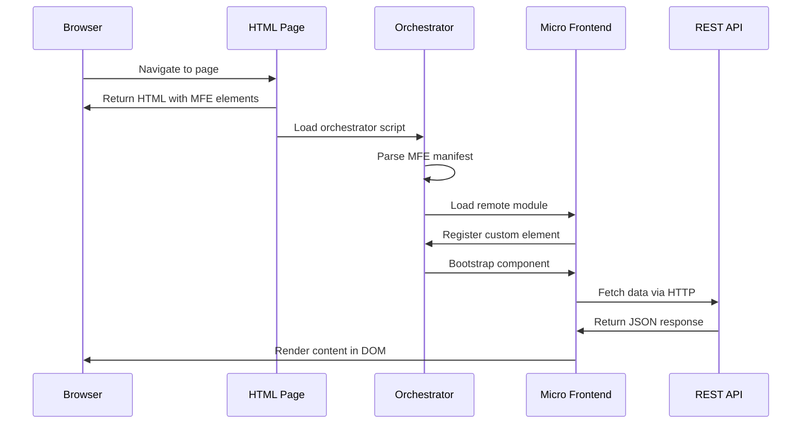

# Wicket + Angular Native Federation Examples

This demo application demonstrates how Angular micro frontends can be loaded into any web application using native federation. The project showcases two independent micro frontend components that can be consumed by a host/shell application. This example includes an orchestrator that uses the Piral feed to fetch 2 angular remotes.

## 🏗️ Architecture Overview

This project uses **Angular Native Federation** to create standalone micro frontends that can be dynamically loaded and integrated into any host application. The architecture follows the micro frontend pattern where each component is:

- **Independently deployable**
- **Technology agnostic** (can be consumed by any framework)
- **Self-contained** with its own dependencies and configuration

### Component Interaction Flow


```mermaid
sequenceDiagram
    participant B as Browser
    participant W as HTML Page
    participant O as Orchestrator
    participant M as Micro Frontend
    participant A as REST API

    B->>W: Navigate to page
    W->>B: Return HTML with MFE elements
    W->>O: Load orchestrator script
    O->>O: Parse MFE manifest
    O->>M: Load remote module
    M->>O: Register custom element
    O->>M: Bootstrap component
    M->>A: Fetch data via HTTP
    A->>M: Return JSON response
    M->>B: Render content in DOM
```

The system consists of:

- **Host** (HTML page) - Host application the shell application.
- **Angular Micro Frontends** (TypeScript) - Standalone components for teasers and recommendations
- **Native Federation** - Module loading and integration system

## 📦 Micro Frontend Components

The project is partially based on the [Tractor Store](https://micro-frontends.org/tractor-store/) example.

### 1. Teasers Component (`exp-teasers`)

- **Purpose**: Displays featured content teasers with images and titles
- **Endpoint**: `./teasers`
- **Custom Element**: `<exp-teasers>`
- **Features**:
  - Responsive grid layout
  - CDN-optimized image loading
  - Dynamic teaser fetching from API

### 2. Recommendations Component (`exp-recommendations`)

- **Purpose**: Shows product recommendations based on SKU input
- **Endpoint**: `./recommendations`
- **Custom Element**: `<exp-recommendations>`
- **Features**:
  - Product-based recommendation engine
  - Grid layout with responsive breakpoints
  - Dynamic content loading via HTTP service

## 🚀 Getting Started

### Prerequisites

- Node.js (v20+ recommended), Angular CLI, Native Federation support

### Installation

#### Orchestrator

```bash

# Install dependencies
npm install

# Build the orchestrator
npm run build

# Start development server
npm start
```

The orchestrator can be loaded into any host application and used to orchestrate native federation remotes.

## 🔧 Configuration

### Angular Environment Configuration

The application uses environment-specific configuration through the `ENV` injection token:

```typescript
export interface EnvironmentConfig {
  production?: boolean;

  /** The url of the current domain (host/shell) */
  domain?: string;

  /** Base URL for micro frontends, From here assets can be loaded */
  scopeUrl?: string;

  /** Tag used for version or environment specific remotes */
  tag?: string;

  /** Whether to flush/clear the cache before initialization */
  flush_cache?: boolean;
}
```

## 🔌 Wicket Micro Frontend Integration

### Base Template Setup

The host base template includes the micro frontend orchestrator:

**BaseTemplate.html**

```html
<html>
  <head>
    <title>Shell</title>
    <meta name="piral" content="https://feed.piral.cloud" />
    <meta name="feed" content="vnf" />
    <link rel="stylesheet" href="./style.css" />
  </head>
  <body>
    <main class="e_HomePage" id="homepage">
      <h1>Explore</h1>
      <exp-teasers></exp-teasers>
      <exp-recommendations></exp-recommendations>
    </main>

    <script type="esms-options">
      { "shimMode": true }
    </script>

    <script type="module-shim">
      window.addEventListener('mfe-loader-available', async (e) => {
          await Promise.all([
              e.detail.mount("@tractor-store/explore", "./recommendations"),
              e.detail.mount("@tractor-store/explore", "./teasers"),
          ])
      }, {once: true});
    </script>

    <!-- Native federation orchestrator -->
    <script src="./dev/orchestrator.js"></script>
  </body>
</html>
```

## 🤝 Contributing

This is a demo project showcasing micro frontend integration patterns. Feel free to extend the examples or adapt them for your specific use case.

## 📄 License

This project is provided as an example/demo. Please check with your organization's licensing requirements before using in production.
